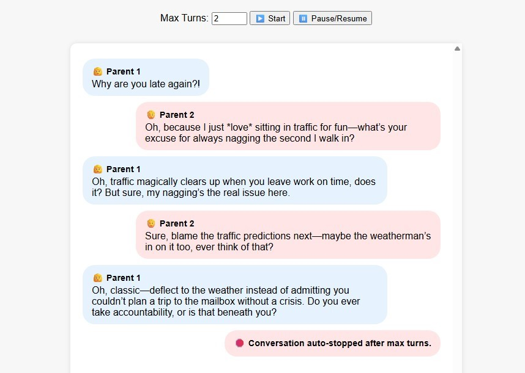

# Your-Parents-Arguing Simulator
This is a web-based chat simulation where two AI-powered characters ("Parent 1" and "Parent 2") argue with each other in short, emotionally charged exchanges. Each parent has a distinct personality, and the dialogue plays out in real-time over a WebSocket connection using the Perplexity AI API. You can set the number of max turns.



## Features
* **FastAPI WebSocket** for real-time communication.

* **Jinja2 templating** to serve a simple HTML frontend.

* **Two simulated AI roles**:

1. Parent 1: Sharp-tongued, critical, escalates.

2. Parent 2: Sarcastic, defensive, deflects blame.

* **Conversation loop** ends after a set number of turns.

* **Perplexity AI integration** for natural language generation.

* **Content sanitization** to clean AI responses.
* Set the number of **max turns**.

## Requirements
* `.env` file with a valid Perplexity API key:
```
PERPLEXITY_API_KEY=your_api_key_here
```
* Install required packages with `pip`:
```
pip install -r requirements.txt
```

## Running the App
1. Create a `.env` file with your `PERPLEXITY_API_KEY`.

2. Ensure you have a `templates/chat.html` file to serve as the frontend.

3. Run the server:
```
uvicorn main:app --reload
```
4. Visit http://localhost:8000 in your browser to start the chat.